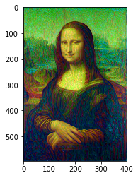
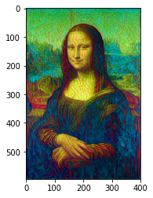
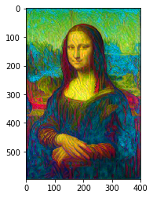
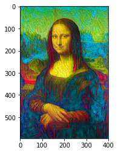
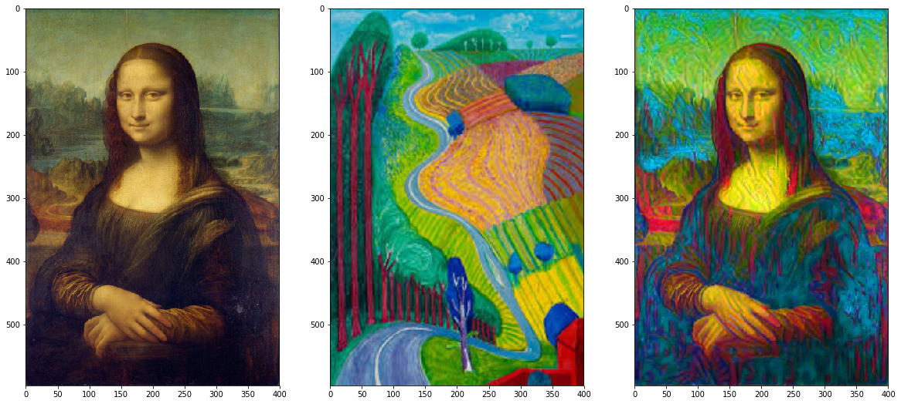

# Neural Style Transfer - Models for extracting styles and transfer to other source  

This model uses VGG Network to extract style from style image and transfer to content image 

Below are progress of Style Transfer model result:

Generated images in iteration

Final Result

There are 3 main parts of this model:

1. **Building Model**: Load VGG Network and load content & style image 

2. **Extracting Featurs**: Get content & style features and implemented gram matrix 

3. **Training**: Train model and generate style transfered image

## List of Hyperparameters used:

* Model = **19 layer VGG Network**
* Iteration - **2000**  
* Optimizer  = **Adam**  
* Initial Learning Rate = **0.003**

